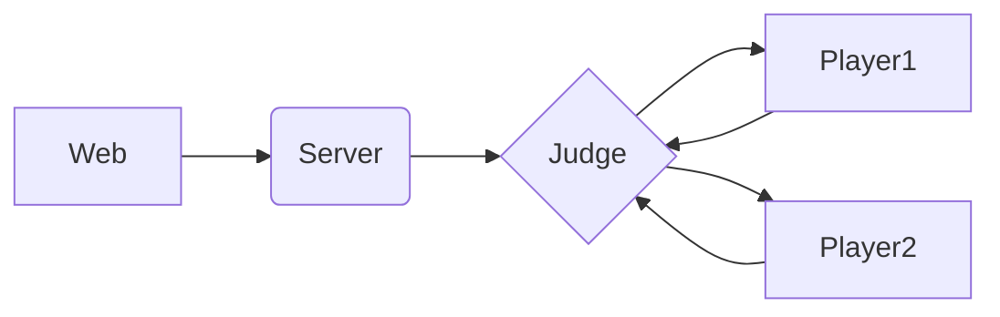

# 五子棋

[TOC]

#### Mango

~~AI的名字~~

能打败baseline了

好像在超时的边缘徘徊，有些点需要4.5s左右

##### 估价函数

> - 活棋分别为$1/10/10^3/10^6$
>
>   一端堵住则除以$\varphi$
>
>   先手$\varphi=10$，后手则为$100$
>
> - 五子为$\infin - dep\times10^7$
>
>   尽可能少的步骤赢，尽可能多的步骤输
>

##### 核心思想

> - 一个6层的min-max search
>
>   迭代加深，略微优化
>
> - 连续放三/四子的策略，略微优化最后几步取胜的过程
>
> - randput策略会往棋子堆里塞棋子
>
> - 根据棋子间的Hamilton距离判定是否换手
>
>   若相差超过太多则不换（swapdist=6）

##### Trick

>- min-max层结果取相反数
>
>   从而每一层取max即可
>
>- 启发式优化
>
>  根据$\Delta value$和周围棋子数来确定搜索顺序
>
>- 不全盘重复计算棋盘价值
>
>  使用增量的方式每次修改棋盘价值，而不是在叶节点全部calc一遍
>
>  大致上可以快2倍
>
>- 使用位运算来优化判空
>
>  似乎减少了5%的时间~~（？）~~
>
>- zobrist hash
>
>  使用unordered_map存储，重复利用
>
>  大致上可以减少50%的搜索次数，减少20%的时间
>
>- 调试上的一点帮助
>
>  输出一些决策过程

#### 前端

- [x] HTML
- [x] CSS
- [x] JavaScript
- [x] Bootstrap
- [x] jQuery(AJAX)

#### 服务端

- [x] Flask

##### 流程

###### Server

> Web->Server: Post
>
> Server->Judge: action

###### Judge

> human: send [x,y] / return [x,y,result]
>
> AI: send "NEXT" /return [x,y,result]

#### 参考资料

1. HTML

   [菜鸟教程](https://www.runoob.com/html/html-quicklist.html)

   [W3Cschool](https://www.w3cschool.cn/html5/)

2. CSS

   [菜鸟教程](https://www.runoob.com/css3/css3-flexbox.html)

3. JavaScript

   [菜鸟教程](https://www.runoob.com/js/js-validation-api.html)

4. jQuery

   [菜鸟教程](https://www.runoob.com/jquery/jquery-ajax-load.html)

5. Bootstrap

   [官网](https://v3.bootcss.com/getting-started/#template)

